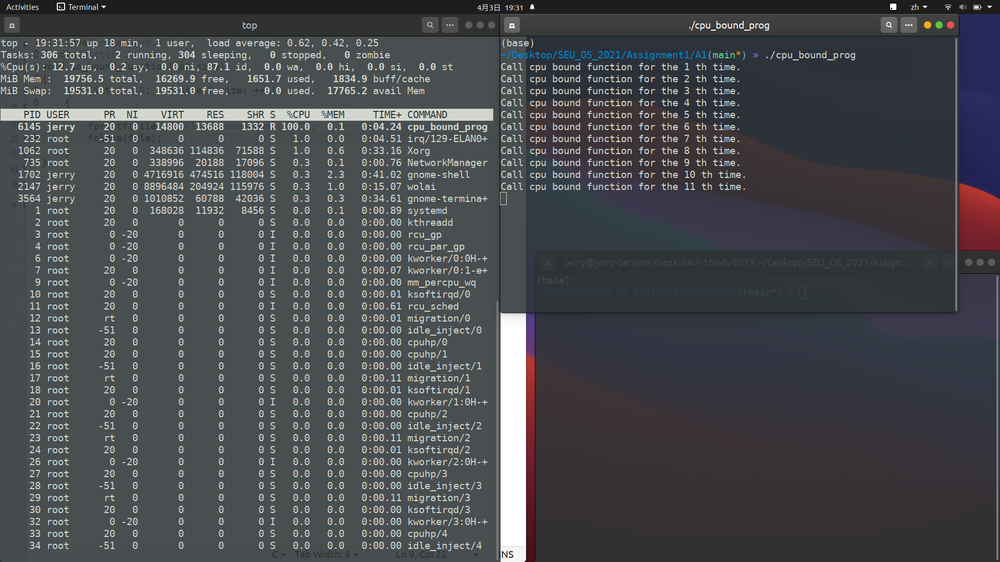
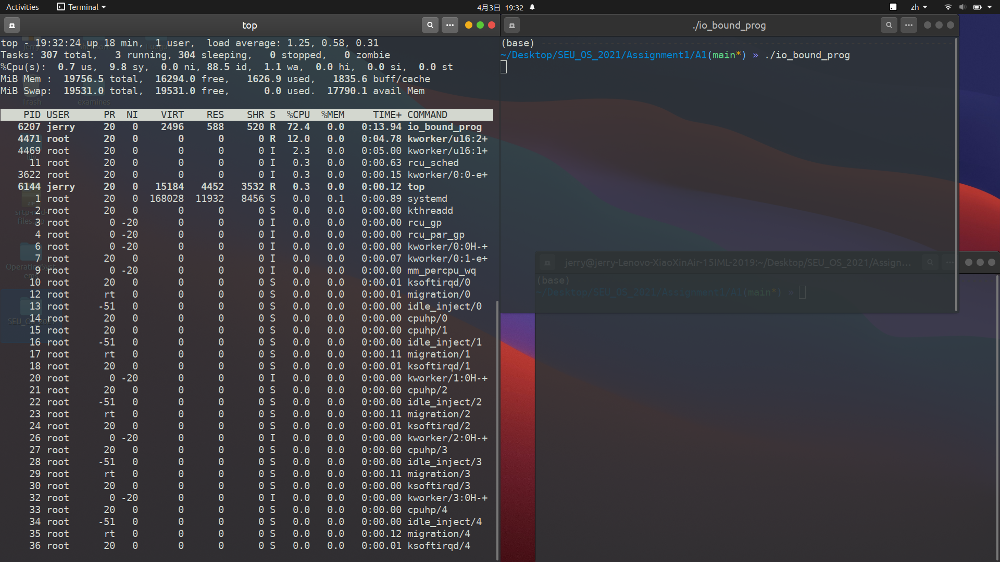
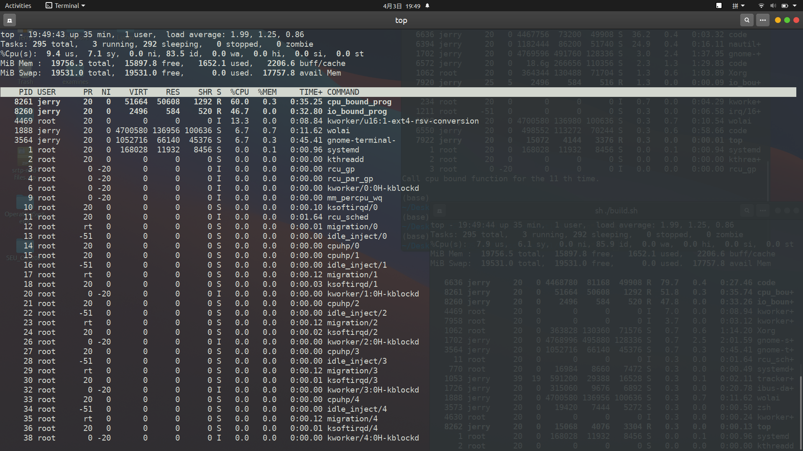
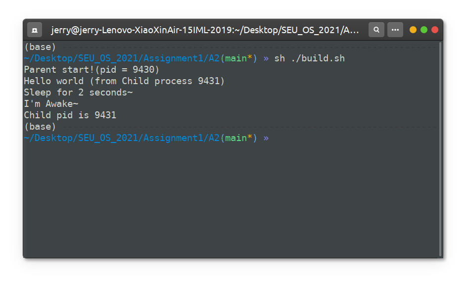
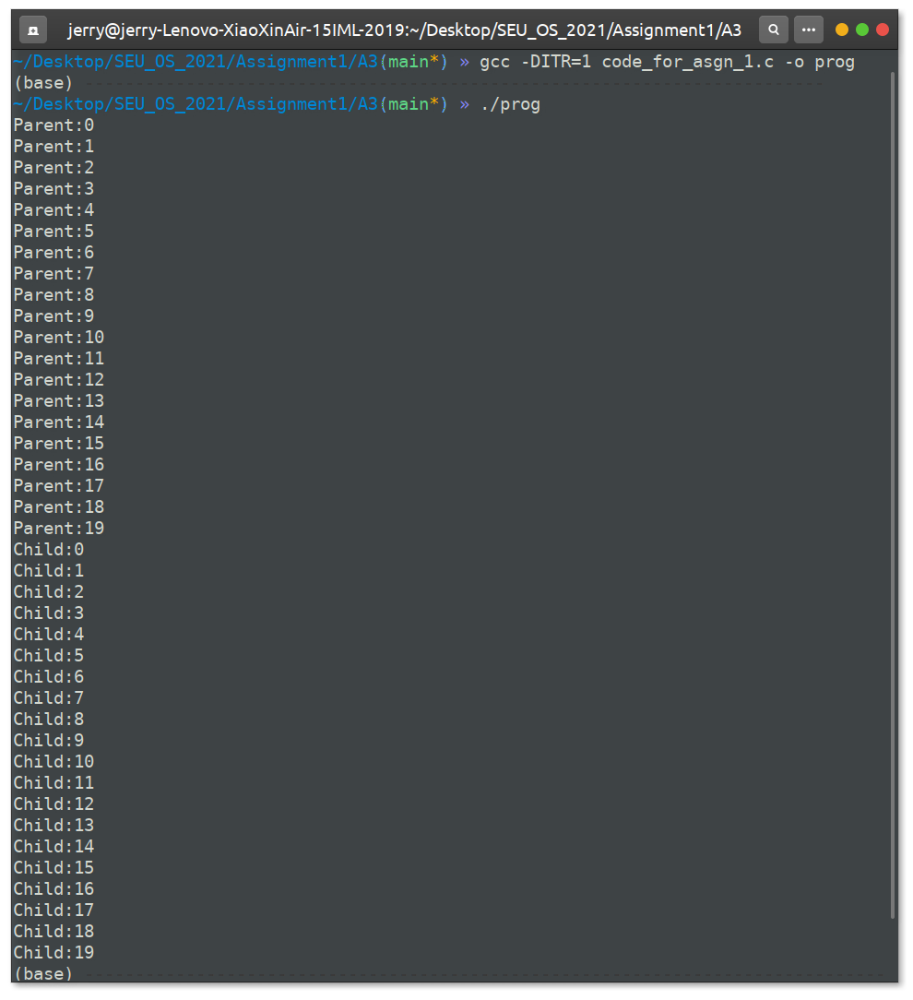
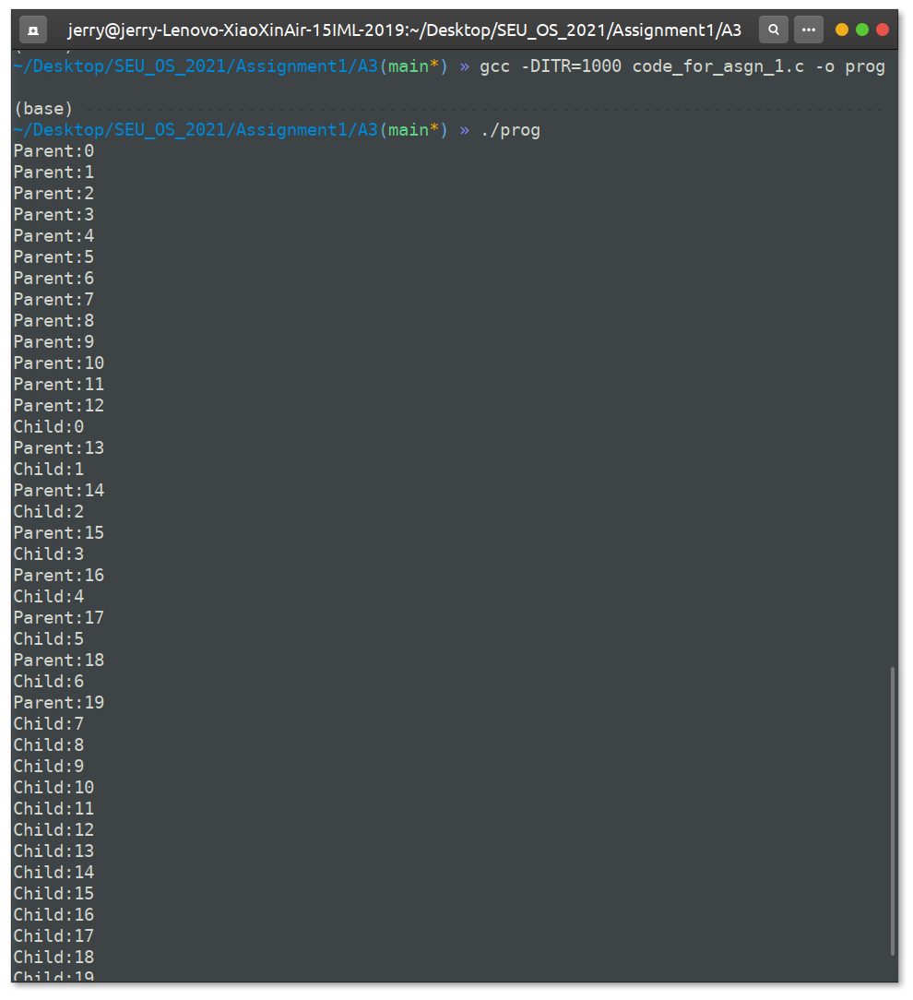
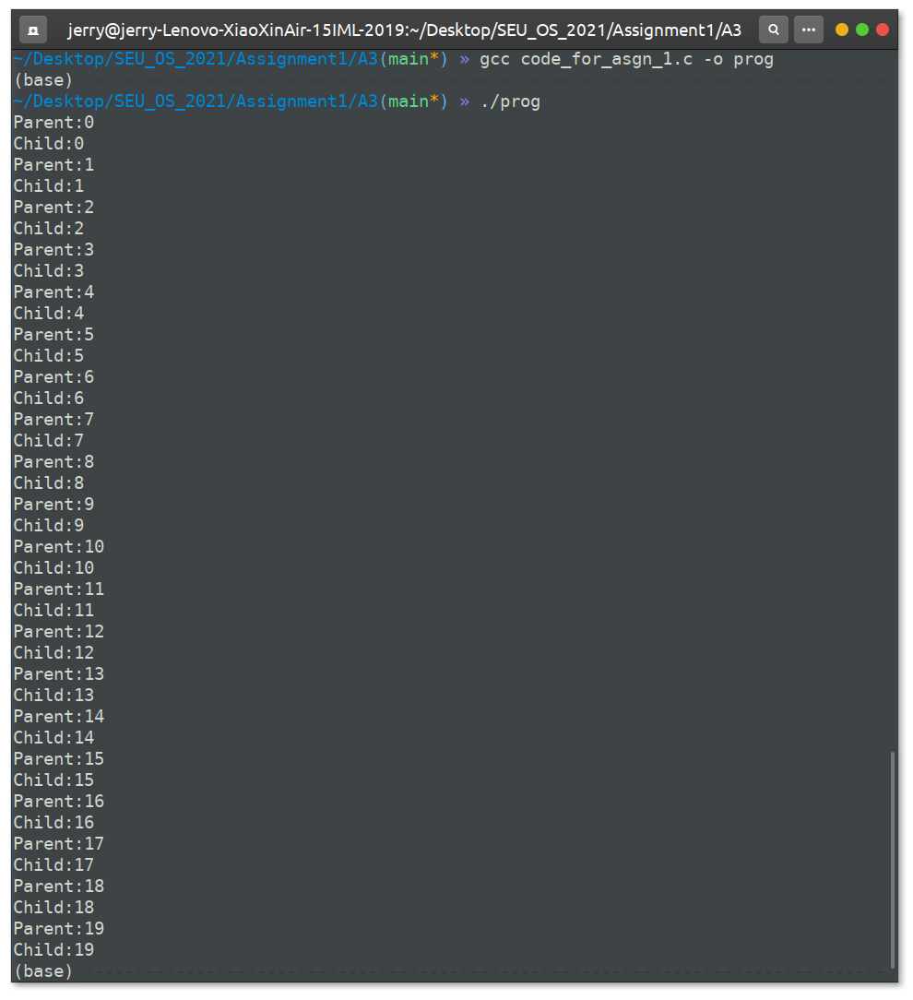
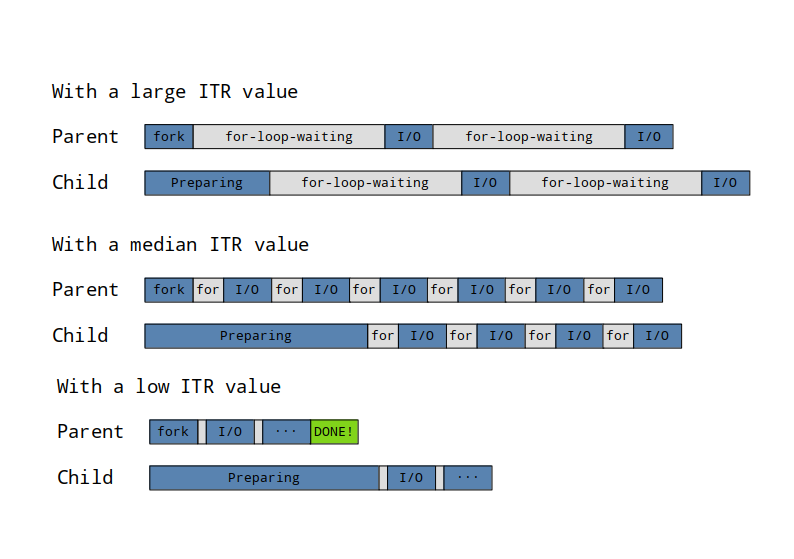
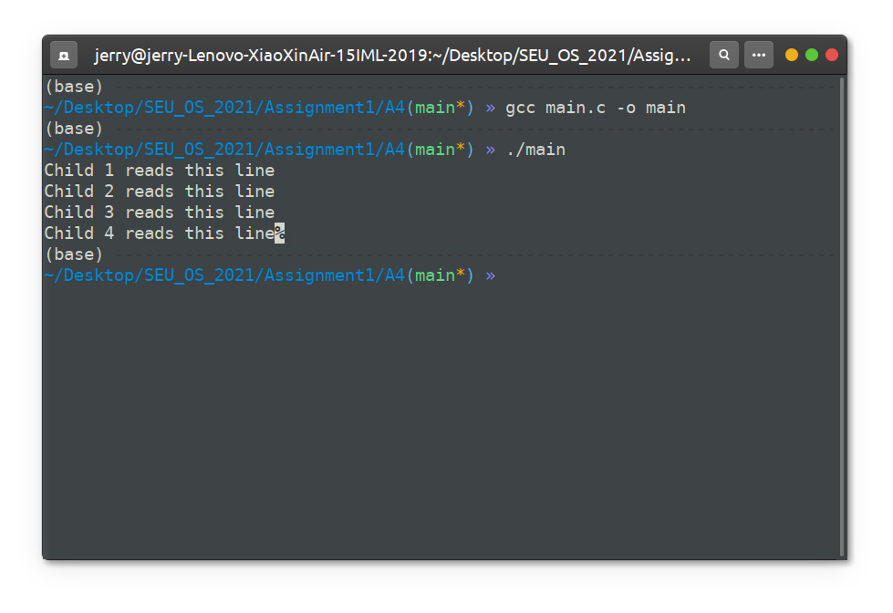
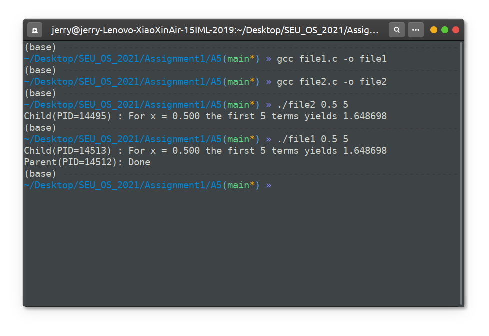

<h1><center>Operating Systems - Assignment 1: Operation on Process</center></h1>

<center>Student: Yang Zherui 61519322</center>
<center>Time: 2021-04-07</center>

## Experiment Object

Learn how to create, work with and manipulate processes in Linux.

## Experiment Content

### Task 1

> Description: Write a CPU bound C program and a *I/O bound* C program (e.g. use a number of `printf` statements within a *while(1)* loop). Compile and execute both of them. Observe the effect of their CPU share using the *top* display and comment.

In this assignment, I wrote a procedure which is doing matrix multiplication as a CPU bound C program, and a procedure which is always calling `printf` as a I/O bound C program. We can run both of them in the command line and observe the effect of their CPU share using `top`. 

#### Codes

##### CPU bound program

The code of `cpu_bound.c`

```c
#include <time.h>
#include <math.h>
#include <stdlib.h>

#include "procedures.h"

static int count = 0;

static float *generate(int n, int m)
{
    float *pmatrix;
    pmatrix = (float*) malloc(sizeof(float) * n * m);
    if (pmatrix == 0)
    {
        printf("Bad alloc");
        abort();
    }
    for (int i = 0; i < n; ++i)
        for (int j = 0; j < m; ++j)
            pmatrix[i * m + j] = 100 / ((float) (i + j));
    return pmatrix;
}

static void destroy(float *pmatrix) { free(pmatrix); }

void cpu_bound_function(int size)
{
    // Matrix Multiplication
    float *A = generate(size, size),
          *B = generate(size, size),
          *C = generate(size, size);
    for (int i = 0; i < size; ++i)
        for (int j = 0; j < size; ++j)
            C[i * size + j] = 0.0f;
    // do multi
    for (int k = 0; k < size; ++k)
        for (int i = 0; i < size; ++i)
            for (int j = 0; j < size; ++j)
                C[i * size + j] += A[i * size + k] + B[k * size + j];
    count++;
    printf("Call cpu bound function for the %d th time.\n", count);
    destroy(A);
    destroy(B);
    destroy(C);
}

```

##### I/O bound program

The code of `io_bound.c`:

```c
#include"procedures.h"
#include<stdio.h>
void io_bound_function(int size)
{
    for (int i = 0; i < size * size; ++i)
    {
        FILE* file = fopen("./tmp.txt", "w");
        fprintf(file, "Call IO bound function");
        fclose(file);
    }
}
```

##### The main program

The code of `procedure.h`:

```c
#include<stdio.h>
void cpu_bound_function(int size);
void io_bound_function(int size);
```

The code of `main.c`:

```c
#include "procedures.h"
int main(int argc, char **argv)
{
    /* For I/O bound program */
#ifndef CPU
    for (int i = 1; i < 100000; i *= 2)
        io_bound_function(i);
#else
    /* For cpu bound program */
    for (int i = 1; i < 100000; i *= 2)
        cpu_bound_function(i);
#endif
    return 0;
}
```

To compile two program:

```sh
$ gcc cpu_bound.c io_bound.c main.c -o io_bound_prog
$ gcc -DCPU cpu_bound.c io_bound.c main.c -o cpu_bound_prog
```

To run these two program only on one CPU core and observe:

```sh
$ taskset -c 0 ./cpu_bound_prog &
$ taskset -c 1 ./io_bound_prog &
$ top
```

#### Result

The screen shot is shown below



<center><i> Picture above: CPU bound program only </i></center>



<center><i> Picture workload workload above: IO bound program only </i></center>



<center><i> Picture above: CPU bound program & IO bound program together</i></center>

As is shown above, when we run CPU bound program only, CPU utilization can arrive at 100%(single core). But for a IO bound program, CPU utilization can only arrive at about 70%. (because of the IO interrupts). When we run two programes together, the CPU utilization can be over 100%, because cpu bound program can run when handling IO interupts.

### Task 2

> Description: Write a program in C that creates a child process, waits for the termination of the child and lists its PID.

To finish this task, we can divide the requirements into two parts:

1. Create a child process: we can use `fork()` to create a child process;
2. Wait for the termination of the child and lists its PID: we can use `waitpid(pid, NULL, 0)` to wait for the termination of its child process whose PID is `pid`

To show the execution of the child process and check the child process's PID, we can print its PID in the code which child process execute. To make sure the parent actually wait for the termination of its child, the child process sleeps for 2 seconds. In this case, if the parent process doesn't wait for the child, it must print the PID of its child first.

The core code for this task is as shown below:

```cpp
pid_t pid = fork();
if (pid)
{
    /* Parent process */
    /* 1. Wait for child process*/
    waitpid(pid, NULL, 0); 
    /* 2. Print child's pid*/
    printf("Child pid is %d\n", pid);
}
else
{
    /* Child process */
    /* 1. echo~ */
    printf("Hello world (from Child process %d)\n", getpid());
    printf("Sleep for 2 seconds~\n");
    /* 2. sleep for several seconds*/
    sleep(2);
    printf("I'm Awake~\n");
}
```

The output is:



### Task 3

> Description: Compile and run the program code for asgn1.c and record your observations. Perform the modification mentioned and answer the questions that follow.
> (a) Comment the inner loop in both the if and the else blocks, compile and run program code for asgn1.c again. Record your observations. 
> (b) Do you find any difference in the output. If not, then what do you think is the role of the inner loop in both if and the else blocks ?
> (c) Modify code for asgn1.c in order to make the child process finish before the parent process starts

#### Part A: Comments

```c++
pid = fork();

if( pid == 0 ){
    /* Child process */
    for ( i=0;i<20;i++){
        /* 1. wait a period of time (with respect to ITR)*/
        for (j=0;j<ITR;j++);
        /* 2. echo*/
        printf("Child:%d\n",i);
    }
} else {
    /* Parent process*/
    for ( i=0;i<20;i++){
        /* 1. wait a period of time (with respect to ITR)*/
        for (j=0;j<ITR;j++);
        /* 2. echo*/
        printf("Parent:%d\n",i);
    }
}
```

#### Part b: The difference of outputs with different ITR

With a low `ITR` (`ITR=1` in the screen shot below) the parent process will print all the `Parent:xx` first and then comes the child process.



With a median `ITR` (`ITR=1000` in the screen shot below) the parent process will print most of the `Parent:xx` first and then comes the child process. But several lines interlace to each other.



With a high `ITR` (`ITR=100000` in the screen shot below) the parent process's `Parent:xx` and child process's `Child:yy` interlace to each other exactly.



The analysis for this phenomenon can be explained by the picture below:



#### Part c: Modification

The required output is:

```sh
Parent:0
Parent:1
....
Parent:18
Parent:19
Child:0
Child:1
....
Child:18
Child:19
```

We can add one `waitpid` before the parent process's starting its I/O job.

```c
...
/* Parent process*/
waitpid(pid, NULL, 0); // wait for child process
for ( i=0;i<20;i++){
    /* 1. wait a period of time (with respect to ITR)*/
}
...
```

### Task 4

> Description: Create a file named my file.txt that contains the following four lines :
> Child 1 reads this line
> Child 2 reads this line
> Child 3 reads this line
> Child 4 reads this line
> Write a C program that forks four other processes. After forking the parent process goes into wait state and waits for the children to finish their execution. Each child process reads a line from the file my file.txt (Child 1 reads line 1, child 2 reads line 2, child 3 reads line 3 and child 4 reads line 4 ) and each prints the respective line. The lines can be printed in any order.

The task composed of these elements:

1. For parent process: First fork 4 other process, then wait for the children to finish. For parent, we can use a `for` loop to fork 4 processes, and store their PID into a static list. Finally, apply another `for` loop to wait for the termination of these processes.
2. For child process: read one special line from file.txt, print it out and return. For child, we use `fseek` and iteration variable `i` from the parent process to prepare to read the right line of the file.

The code is shown below:

```c
#include <unistd.h>
#include <stdio.h>
#include <sys/wait.h>
int main()
{
    pid_t pid[4];
    for (int i = 0; i < 4; ++i)
    {
        pid[i] = fork();
        if (pid[i] == 0){
            /* child process */
            FILE* file = fopen("./file.txt", "r");
            
            char s[32];
            fseek(file, (long) i * 24L, SEEK_SET);
            fgets(s, 32, file);
            
            fprintf(stdout,"%s", s);
            fclose(file);
            return 0;
        }
    }
    for (int i = 0; i < 4; ++i)
        waitpid(pid[i], NULL, 0);
    return 0;
}
```

The output of the program is:



### Task 5

> Description: Write two programs file1.c and file2.c. Program file1.c uses these:
>
> (a) fork() to launch another process
> (b) exec() to replace the program driving this process, while supplying arguments to file2.c to complete its execution
> (c) wait() to complete the execution of the child process
> (d) file1.c takes two arguments x (a number less than 1) and n (number of terms to be added, 1 or more). For example: file1 0.5 5
> (e) When the child proces finishes, the parent prints: 
>
> <center>Parent(PID=yyy) : Done</center>
>
> Program file2.c requires two arguments to obtain the approximate value of ex by adding the first n terms in the relation : exp(x) = 1+x+x2/2!+x3/3!+....... and prints the result in the format:
>
> <center>Child(PID=yyy) : For x = 0.5 the first 5 terms yields 1.6484375</center>

First we focus on file2: This program requires **exactly two arguments**, n and x. The output for file2 is composed of PID, x, n, and the exp(x) (the sum of first n terms in its Taylor series).

```c
#include <unistd.h>
#include <stdio.h>
#include <stdlib.h>
int main(int argc, char **argv)
{
    /* 1. Check the arguments */
    if (argc != 3)
    {
        printf("Error #args");
        exit(1);
    }
    /* 2. preprocess n and x */
    float x = atof(argv[1]);
    int n = atof(argv[2]);
    float t = x;
    float result = 1;

    /* 3. Calculate exp(x) using n terms*/
    for (int i = 1; i <= n; ++i)
    {
        result += t;
        t *= x / (i + 1);
    }

    /* 4. Print the required line*/
    printf("Child(PID=%d) : For x = %.3f the first %d terms yields %f\n", getpid(), x, n, result);

    return 0;
}
```

We can check the output of file2 in command line:

```shell
$ gcc file2.c -o file2
$ ./file2 0.5 5
Child(PID=1722) : For x = 0.500 the first 5 terms yields 1.648698
```

Next we focus on file1: this program also takes **exactly 2 arguments** n and x. After check the arguments, it forks another process:

1. For child: it calls `execlp` to replace itself by another program (file2)
2. For parent: it wait for the termination of the child process and then print the line.

The code for `file1.c` is shown below:

```c
#include<unistd.h>
#include<stdio.h>
#include<stdlib.h>
#include<sys/wait.h>
int main(int argc, char** argv)
{
    if (argc != 3)
    {
        printf("Error #args");
        exit(1);
    }
    
    /* a. launch another process */
    pid_t pid = fork(); 

    if (pid) {
        /* Parent */
        /* c. wait for the child */
        waitpid(pid, NULL, 0);
        /* e. print*/
        printf("Parent(PID=%d): Done\n", getpid());

    } else {
        /* Child */
        
        execlp("./file2", "./file2", argv[1], argv[2], NULL);
    }
    return 0;
}
```

The output of the program is:



## Summary

In this lab, we can draw the following conclusions:

Firstly, the time to create a child process is relatively high: For example, in task 3, the delay of creating a process can be high enough to make the output become different.


Secondly, Child process cannot share one file stream with each other by simply `fork()` from the parent.

In task 4, I meant not to use `fseek` in the program. In that case, I didn't get my desired output.

Source code:

```c
#include <unistd.h>
#include <stdio.h>
#include <sys/wait.h>
int main()
{
    pid_t pid[4];
    FILE* file = fopen("./file.txt", "r");
    for (int i = 0; i < 4; ++i)
    {
        pid[i] = fork();
        if (pid[i] == 0){
            /* child process */
            
            char s[32];
            // fseek(file, (long) i * 24L, SEEK_SET);
            fgets(s, 32, file);
            fprintf(stdout,"%s", s);
            return 0;
        }
    }
    for (int i = 0; i < 4; ++i)
        waitpid(pid[i], NULL, 0);
    fclose(file);
    return 0;
}
```

Output:

```sh
Child 1 reads this line
��;�Child 2 reads this line
��;�
```

Opps, in this case, some sharing variables will be in chaos.

Thirdly, by using command `man xxxx` there is always an complete, accurate, and detailed manual for me to read, which is of great help to this lab and for the following study.